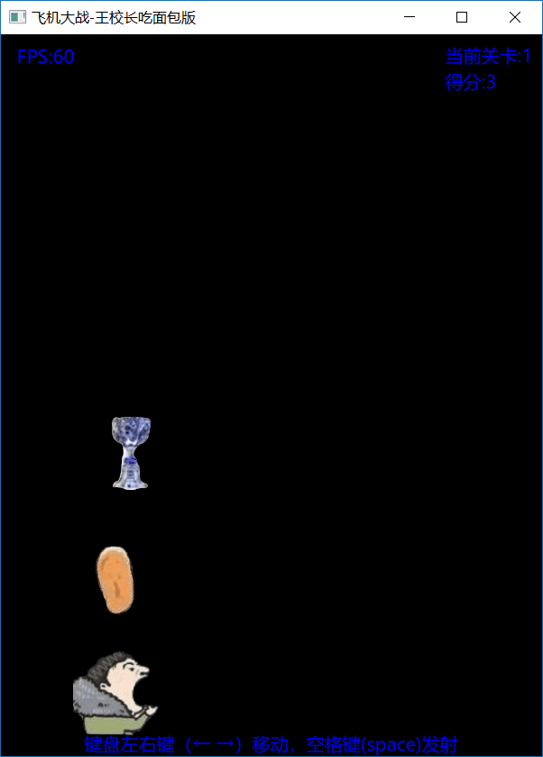

# PlaneFight

## 简介：

飞机大战- 王校长吃面包版

蹭个热度，比较粗糙，没有精雕细琢。
## 效果图：

## 功能：

* 点击开始按钮开始游戏
* 键盘左右键控制王校长左右移动
* 空格键发射面包

## 开发环境

* Qt 5.9.x Windows/Ubuntu

#### 联系方式:
***
| 作者 | 涛哥                          |
| ---- | -------------------------------- |
| QQ   | 759378563                        |
| 微信 | xsd2410421                       |
| 邮箱 | jared2020@163.com                |
| blog | https://wentaojia2014.github.io/ |

###### 请放心联系我，乐于提供相关帮助
***
#### **打赏**

###### 觉得分享的内容还不错, 就请作者喝杯咖啡吧~~
***
